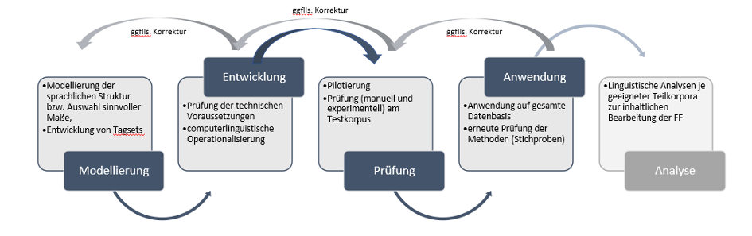
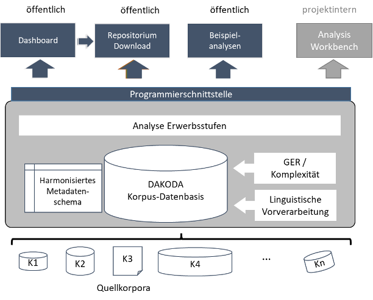

## Ziele

DAKODA verfolgt drei Kernziele:

  
<b>1.	Explorative automatisierte Analysen von syntaktischen Erwerbsstufen </b>

  

  

  Linguistischer Dreh- und Angelpunkt in DAKODA sind die sogenannten Erwerbsstufen, die v.a. basale Wortstellungsmuster im Fremd- und Zweitsprachenerwerb (L2) fokussieren. Sie wurden zunächst im ZISA-Projekt beschrieben (Clahsen et al., 1983) und dann insbesondere in der Processability Theory weiterentwickelt, wo sie eine fundamentale Rolle spielen (Lenzing et al., 2019; Pienemann, 1998; 2005). Auch in der Sprachdiagnostik finden sie in verschiedenen profilanalytischen Verfahren breite Anwendung (z.B. Grießhaber, 2012). Die Erwerbsstufen sind der wohl am intensivsten beforschte linguistische Aspekt des Deutschen als L2. Dennoch bleiben teils grundlegende Gesichtspunkte dazu eher lückenhaft beantwortet, und es ergeben sich weiterführende Fragestellungen. 

  

  Zum einen gilt dies für unterschiedliche Facetten von Variation. Denkbar ist, dass verschiedene lernendeninterne (z.B. das Erwerbsalter) und -externe (z.B. Aufgabenstellungen) Variationsfaktoren den Aneignungsverlauf der für die Erwerbsstufen relevanten sprachlichen Gegenstände beeinflussen könnten. Auch die beträchtliche inter-, aber auch intraindividuelle lernersprachliche Variation selbst ist wieder ins Zentrum der Aufmerksamkeit der L2-Erwerbsforschung gerückt und wird durch verbesserte Analysemethoden deutlicher sichtbar als zuvor: Erwerbsverläufe erweisen sich oft als nicht-linear und dynamisch. Unterschiedliche Variationsdimensionen spielen für die Analysen im DAKODA-Projekt deshalb eine wichtige Rolle. 

  

  Zum anderen ist der Fokus der Erwerbsstufen auf grundlegende Wortstellungsmuster und einige wenige morphologische Phänomene aus linguistischer Sicht eng. Mit welchen anderen sprachlichen Aspekten die Stufen zusammenhängen, ist bislang kaum erforscht. Durch die explorative automatisierte Analyse ausdifferenzierender sprachlicher Phänomene (z.B. Typen der Vorfeldbesetzung für den Erwerb von V2) und der linguistischen Komplexität sowie die vorgesehene automatische Klassifizierung der lernersprachlichen Texte in Niveaustufen des Gemeinsamen europäischen Regerenzrahmens (GER, Europarat, 2001, 2020) sollen in DAKODA etwaige derartige Zusammenhänge ins Licht gerückt werden. 

  

  Grundsätzlich ist zu konzedieren, dass automatisierte Lernersprachenanalysen von erheblichen technischen Herausforderungen geprägt und fehleranfällig sind. Ziel von DAKODA ist deshalb zunächst eine erste, fundierte und gut reflektierte Einschätzung prinzipieller Möglichkeiten und Grenzen automatischer Analyseverfahren für L2-Erwerbsstufen des Deutschen. Dazu werden die in DAKODA zu entwickelnden automatisierten Annotationsverfahren iterativ in mehreren Qualitätsprüfungszyklen prozessorientiert hinsichtlich ihrer Genauigkeit und Validität eingeschätzt und revidiert. Die geplanten Tools tragen also explorativen Charakter. 

  

    

      

        
      

    

  

  

  
<b>2. Zusammenführung vieler Lernerkorpora; Zugang über ein Dashboard und ein Repositorium </b>

  

  

  Viele Studien befassen sich empirisch mit den oben beschriebenen Erwerbsstufen und analysieren in der Regel selbst neu erhobene Daten. Allerdings beziehen sich diese Arbeiten oft auf wenige Lernende. Hinzu kommt, dass die L2-Daten – aus oft plausiblen rechtlichen und/oder ethischen oder aber ressourcenbezogenen Gründen – meist nicht publiziert werden. Öffentliche Lernerkorpora des Deutschen wiederum sind nicht immer leicht auffindbar und/oder zugänglich. Größere Lernerkorpora wie etwa FALKO oder MERLIN sind nicht hinsichtlich der Erwerbsstufen annotiert.
  

  

  Auf inhaltlich-methodischer Ebene würde eine breitere Datenbasis Befunde zum L2-Erwerb somit auf eine deutlich solidere Grundlage stellen. Auf Ebene des Datenmanagements entspricht eine Veröffentlichung von Forschungsdaten den
  <a href="https://forschungsdaten.info/themen/veroeffentlichen-und-archivieren/faire-daten/">FAIR-Prinzipien</a>: Daten sollen auffindbar, zugänglich, interoperabel und wiederverwendbar sein.
  

  

  Vor diesem Hintergrund sollen in DAKODA möglichst viele veröffentlichte und, so rechtlich und ethisch möglich, auch bislang unveröffentlichte Lernerkorpora technisch zusammengeführt werden. Bislang haben bereits über 40 Kolleg:innen einer Zusammenarbeit zugestimmt. Zu DAKODA werden unter anderem das <a href="https://www.merlin-platform.eu/#">MERLIN-Korpus</a> und Korpora der <a href="https://hu-berlin.de/falko">FALKO-Familie</a> beitragen, aber auch <a href="https://corpora.uni-hamburg.de/hzsk/de/islandora/object/spoken-corpus:hamatac">HaMaTaC</a> und <a href="https://www.fdr.uni-hamburg.de/record/1483#.Y-OzF62ZNPY">HaMoTiC</a> oder das <a href="https://archive.mpi.nl/islandora/object/lat%3A1839_00_0000_0000_0004_CCAC_E">ESF-Korpus</a>. Wenn Sie Interesse an einer Datenspende haben, kontaktieren Sie uns gern.
  

  

  Diese Lernerkorpusdaten werden mit explorativen automatisierten Annotationen angereichert (siehe Ziel 1). Die Lernerkorpora werden dann zum einen in einem Online-Speicherort (Repositorium) abgelegt. Von dort können sie in Abhängigkeit von datenschutz- und lizenzrechtlichen Bestimmungen heruntergeladen werden. Zum anderen wird in DAKODA ein Dashboard produziert, also eine Nutzer:innenschnittstelle.  Dafür entwickelt das Team ein Metadatenschema, über das die einzelnen Korpora miteinander verankert werden, sodass korpusübergreifend in ihnen gesucht werden kann.
  

  

  Das Dashboard wird auf den Kernschwerpunkt von DAKODA bezogene Such- und Filterfunktionen sowie einige Visualisierungsfunktionen beinhalten. DAKODA ist damit keine allgemeine Korpusinfrastruktur für Lernerkorpora des Deutschen, sondern konzentriert sich auf die genannten, ausgewählten linguistischen Gegenstände und deren explorative automatisierte Analyse.
  

  

  
<b>3. Förderung der Datenkompetenzen des wissenschaftlichen DaF-/DaZ-Nachwuchses </b>

  

  

  Übergeordnetes Ziel von DAKODA ist die Förderung der Datenmanagement- und Datenanalysekompetenzen des wissenschaftlichen DaF/DaZ-Nachwuchses.  Dieses Desiderat erwächst aus den immer größeren zur Verfügung stehenden, oft heterogenen (L2-)Datenmengen und vor dem Hintergrund der wachsenden Bedeutung des Forschungsdatenmanagements. DAKODA soll Wissen zum Umgang mit großen Datensätzen in korpusübergreifenden Ansätzen, zu Datenformaten und -konvertierungen, automatischen Analysen und deren Herausforderungen, aber auch zu Visualisierungsmöglichkeiten nicht nur innerhalb des Projekts selbst, sondern darüber hinaus auch an die Community von Nachwuchskolleg:innen des Fachs DaF/DaZ vermitteln. Deshalb wird eine Reihe offener digitaler Workshops und Hackathons durchgeführt, um solche Fähigkeiten tiefer im Fach zu verankern. 

  

  Wir informieren über aktuelle Veranstaltungen in einem Newsletter. Sprechen Sie uns an, wenn Sie Interesse haben.
  

  

 

## Workflow

Der Projektworkflow wird in der folgenden Abbildung zusammengefasst:

  

    

      
    

  

Im Projekt wird zunächst eine Reihe an Lernerkorpora des Deutschen als L2 zusammengeführt und technisch konsolidiert. Es haben bereits über 40 Kolleg:innen ihre Zusammenarbeit zugesagt. Datenformate werden vereinheitlicht und konvertiert. Ein harmonisiertes, korpusübergreifendes Metadatenschema wird entwickelt. Dies geschieht unter Anwendung und in Erweiterung vorliegender Standardisierungsvorschläge (Granger & Paquot, 2017[^1]; König et al., 2022[^2]). Ziel ist, die Daten korpusübergreifend nach Metadaten durchsuchen und filtern zu können. Außerdem wird ein geeignetes Mehrebenenannotationsformat gewählt.

Dann wird eine einheitliche linguistische Vorverarbeitung (POS-Tagging, Parsing) durchgeführt und erprobt. Es schließen sich unterschiedliche automatisierte Analysen an. Diese betreffen zum einen den Kerngegenstand von DAKDOA, die Erwerbsstufen. Außerdem soll ein automatisches Klassifikationsverfahren zur Einschätzung der GER-Niveaus von Lernendentexten entwickelt werden, und es erfolgen automatisierte Analysen der linguistischen Komplexität.

Alle in DAKODA durchgeführten Analysen werden durchgeführt, ohne dass die originalen Fassungen der Quellkorpora verlorengehen; DAKODA-Annotationen werden zudem transparent als solche kenntlich gemacht.
Resultat der Analysen sollen eine Nutzer:innenschnittstelle zur Recherche in den Daten (Dashboard) und ein Repositorium zum Download sein; Beispielanalysen können beispielsweise über Jupyter Notebook zugänglich gemacht werden.
Datenschutz- und lizenzrechtliche Vorgaben werden im Projekt streng beachtet.

[^1]: Granger, S. & M. Paquot (2017). Towards standardization of metadata for L2 corpora. Invited talk at the CLARIN workshop on Interoperability of Second Language Resources and Tools, 6-8 December 2017, University of Gothenburg, Sweden
[^2]: König, A., Frey, J., Stemle, E., Paquot, M. (2022). Towards standardizing LCR metadata. Paper presented at the Learner Corpus Conference in Padova, Italy, 22-24 September 2022, Università di Padova.
